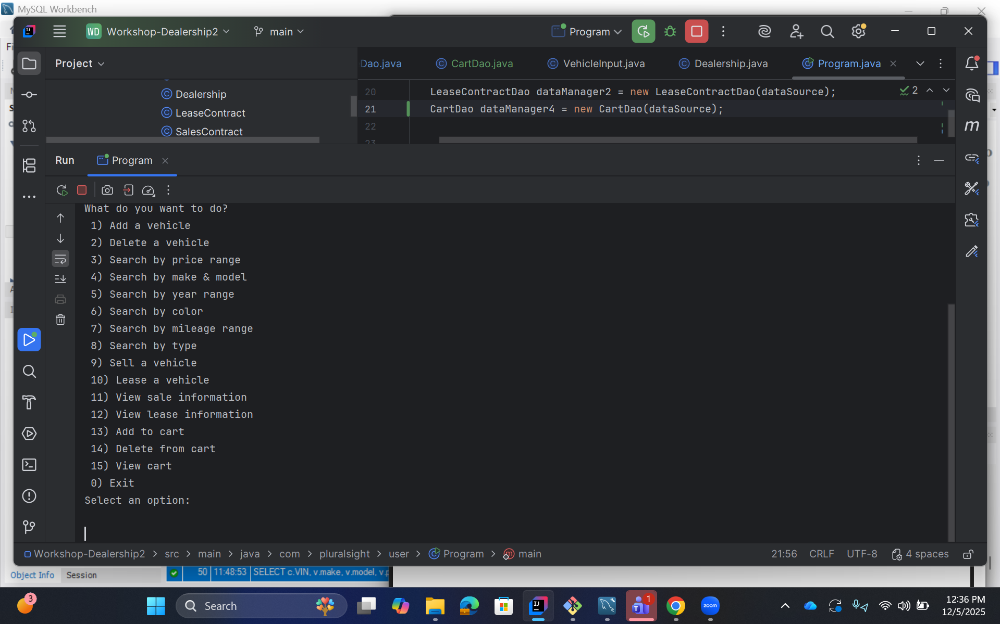

# 🚗 JDBC Car Dealership Application

The **Car Dealership JDBC Project** is a console-based Java application that simulates a car dealership system using a **MySQL database** instead of CSV files. Users can browse vehicles, search by different criteria, add and remove vehicles, lease or purchase vehicles, and manage a cart.

This project replaces file-based persistence with full **CRUD database operations** using JDBC, DAOs, and prepared statements. It follows the structure from Workshop 5, integrated with the database script from Workshop 7.

---

## 📚 Table of Contents
- [Tech Stack](#-tech-stack)
- [Project Structure](#-project-structure)
- [Features](#-features)
- [Run Instructions](#run-instructions)
- [Screenshots](#screenshots)
- [Interesting Code Snippet](#interesting-code-snippet)
- [Author](#-author)

---

## 🛠️ Tech Stack

- **Java 17+**
- **Maven**
- **MySQL 8**
- **JDBC**
- **Apache Commons DBCP2** (connection pooling)
- **IntelliJ IDEA**

---

## 📂 Project Structure

```
src/main/java
└── com.pluralsight.dealership
├── model/
│ ├── Vehicle.java
│ ├── SalesContract.java
│ ├── LeaseContract.java
│ ├── Cart.java
│ └── Dealership.java
├── dao/
│ ├── VehicleDao.java
│ ├── SalesContractDao.java
│ ├── LeaseContractDao.java
│ └── CartDao.java
├── inputManager/
│ ├── ContractsFileInput.java
│ └── VehicleInput.java
├── user/
│ ├── UserInterface.java
│ └── Program.java
```
---

## 🧠 Features
✔ Vehicle Searching

Users can search the database by:

- Price Range

- Make/Model

- Year Range

- Color

- Mileage

- Vehicle Type

Each option uses a parameterized prepared statement, preventing SQL injection.

✔ Vehicle Management CRUD

- Add Vehicle

- Delete Vehicle

- Update Vehicle Information

✔ Contracts

- Sale Processing (writes to sales_contracts)

- Lease Processing (writes to lease_contracts)

✔ Cart Feature (NEW)

- Add a vehicle to cart

- View vehicles in cart

- Remove a vehicle from cart

Purpose: Allows the user to select multiple vehicles before making sale or lease decisions.

---

## ▶️ Run Instructions
1. Configure MySQL

Import the SQL schema + insert data:
```
mysql -u root -p < car_dealership.sql
```
2. Update Connectivity

In your data source configuration:
```
dataSource.setUrl("jdbc:mysql://localhost:3306/dealership");
dataSource.setUsername("root");
dataSource.setPassword("yourpassword");
```
3. Build & Run
```
   mvn clean install
   java -jar target/dealership.jar
```
---

## 🖼️ Screenshots
Homescreen:

Vehicle Display:


---

## 💡 Interesting Code Snippet
```
public int vehicleAdd() {
        try (Connection connection = dataSource.getConnection();
             PreparedStatement preparedStatement = connection.prepareStatement("INSERT INTO vehicles (VIN, Sold, color, make, model, price, year, mileage, type) VALUES (?, ?, ?, ?, ?, ?, ?, ?, ?);", Statement.RETURN_GENERATED_KEYS);) {

            preparedStatement.setInt(1, VehicleInput.addVehicle1());
            preparedStatement.setBoolean(2, VehicleInput.addVehicle2());
            preparedStatement.setString(3, VehicleInput.addVehicle3());
            preparedStatement.setString(4, VehicleInput.addVehicle4());
            preparedStatement.setString(5, VehicleInput.addVehicle5());
            preparedStatement.setDouble(6, VehicleInput.addVehicle6());
            preparedStatement.setInt(7, VehicleInput.addVehicle7());
            preparedStatement.setInt(8, VehicleInput.addVehicle8());
            preparedStatement.setString(9, VehicleInput.addVehicle9());

            int rows = preparedStatement.executeUpdate();

            System.out.println("Rows updated: " + rows);

            try (ResultSet keys = preparedStatement.getGeneratedKeys();) {

                while (keys.next()) {
                    System.out.println("Keys added: " + keys.getInt(1));
                    return keys.getInt(1);
                    }
                }
        } catch (SQLException e) {
            throw new RuntimeException(e);
        }
        return 1;
    }
```
Why it's interesting:
This is interesting to me because the user is able to add a vehicle to the SQL database from inside the Java CLI app.
It then tells you how many columns were updated in response to the vehicle addition.

---

## 👨‍💻 Author

Prince Haywood
📍 Playa Vista, California